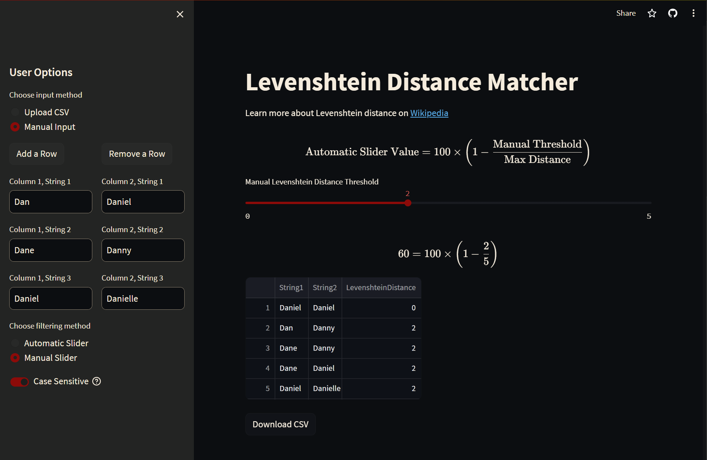

# Levenshtein Distance Matcher

## Description

This project is a text-matching tool that uses the Levenshtein distance algorithm to find the similarity between sets of strings. Built with Python and Streamlit, this tool allows users to upload CSV files or manually input strings for comparison. Users can also fine-tune the matching criteria using automatic or manual sliders.



## Table of Contents

- [Installation](#installation)
- [Usage](#usage)
- [Contributing](#contributing)
- [License](#license)

## Installation

Clone the repository:

```bash
git clone https://github.com/dvonpasecky/fuzzy-matcher.git
cd fuzzy-matcher
```

### Using pip

Install the required packages:

```bash
pip install -r requirements.txt
```

### Using conda

You can also use conda to install the required packages:

```bash
conda install --file conda-requirements.txt
```

## Usage

### Upload CSV File

1. Choose "Upload CSV File" from the sidebar.
2. Upload your CSV file. The file should contain two columns of strings to be compared.

### Manual Input

1. Choose "Manual Input" from the sidebar.
2. Manually enter strings in the columns that appear.

### Filtering Method

Choose either the "Automatic Slider" or the "Manual Slider" to adjust the matching criteria.

### Case Sensitivity

Toggle the "Case Sensitive" option on for case-sensitive matching.

## Contributing

Pull requests are welcome. For major changes, please open an issue first to discuss what you would like to change.

## License

[MIT License](LICENSE)
